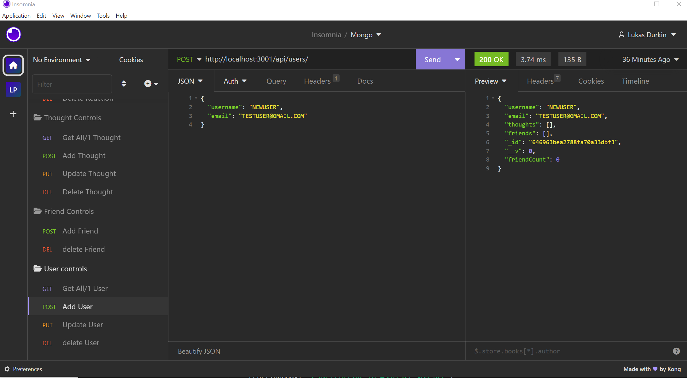

# Social Network
This is a social network API 

## Description

This is a backend api that lets the user perform basic functions for a social media website.  This includes finding one, finding all, adding, removing and updating a user.  Adding and removing friends from a user.  Adding, updating and removing thoughts from a user. And adding and removing responses from those thoughts

## Usage

Used in the terminal to start the program and then run in insomnia as shown in the demonstration video and screenshot provided below.

## Credit

Lukas Durkin & the great help I got from Leif and Fred!

## Demo Video Link

https://drive.google.com/file/d/1c-RoWNEE0IhbY82ootwSmJoq3wOAOjoA/